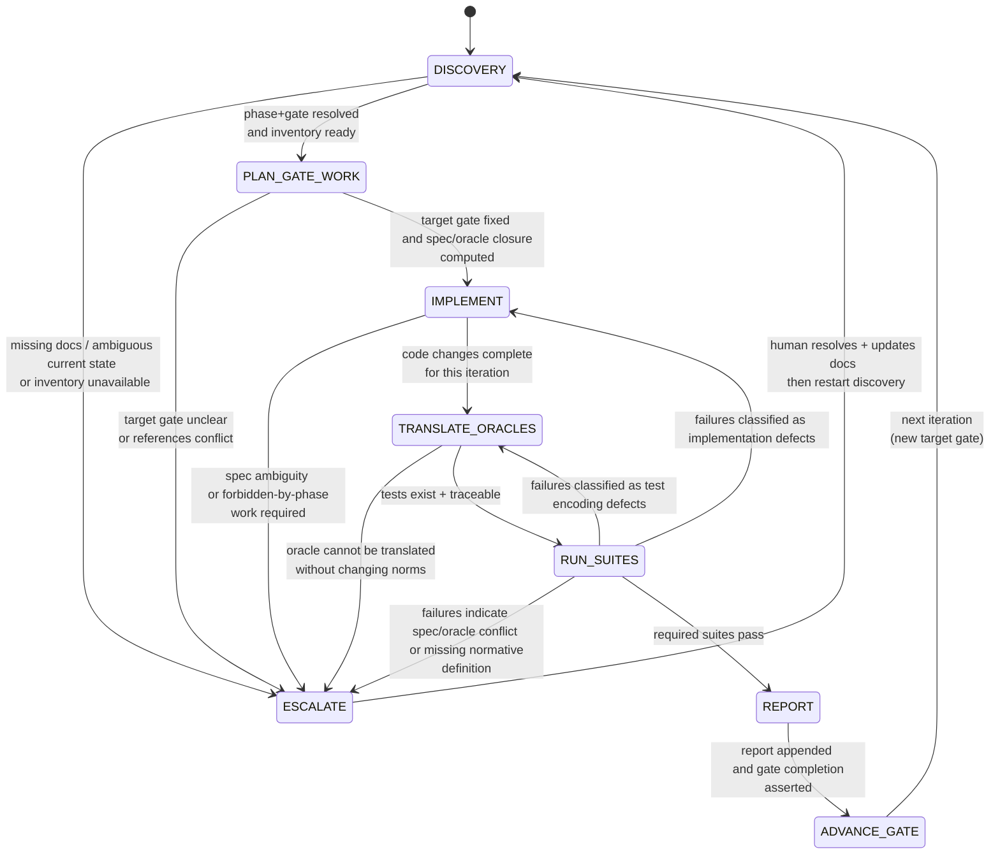

# WORKFLOW

## 1. Purpose

This document defines the **normative operational procedure** for evolving this repository.

It integrates:

* documentation discovery rules,
* architectural contracts,
* oracle authority,
* acceptance gates,
* test execution grouping,
* reporting obligations.

This document defines **how work proceeds** from one valid repository state to the next. It defines execution sequencing and decision control.

---

# 2. Pre-Execution Discovery Phase (Mandatory)

Before any modification:

### 2.1 Build Documentation Context

One of:

* Traverse `docs/` and parse YAML metadata; or
* Load `DOC_INVENTORY.json`.

The inventory is authoritative for:

* DOC_ID resolution,
* doc_scope validation,
* layer inference,
* normative vs non-normative filtering.

Filesystem guessing is prohibited.

---

### 2.2 Determine Current State

Read:

* `@PHASES`
* `@ACCEPTANCE_GATES`
* `@IMPLEMENTATION_REPORTS`

Determine:

* Current repository phase
* Highest passed gate
* Next eligible gate

If unclear → stop and escalate.

---

# 3. Target Gate Selection

Work must target **exactly one gate** at a time.

Rules:

* No multi-gate jumps.
* No speculative future behavior.
* No partial cross-gate blending.

The selected gate determines:

* Applicable specs
* Applicable oracles
* Required test suites (via `@TEST_PLAN`)
* Allowed feature surface

---

# 4. Specification Closure

## 4. Specification and Oracle Closure

Before writing code:

1. Identify all normative **spec documents** relevant to the selected gate.
2. Identify all **oracle documents** required for that gate.
3. For the core components, load `@CORE_ORACLE_INDEX` and resolve:
    * Required oracle subset for the gate.
    * Any conditional applicability (e.g., hold enabled).
    * Oracle dependency graph.
   The oracle dependency graph defined in `@ORACLE_CORE` and mirrored in `CORE_ORACLE_INDEX.json` MUST be respected during implementation.
4. Compute reference closure using DOC_ID references.

If ambiguity, missing authority, or conflict is detected:

* Stop.
* Escalate.
* Do not guess.

---

# 5. Implementation Loop (Single Gate)

For the selected gate:

### 5.1 Minimal Implementation

* Implement only what is required by the specs.
* Respect architectural boundaries.
* Respect oracle dependency order when working on core.
* Do not implement behavior for oracles not required by the current gate.
* No undocumented features.
* No anticipatory extensions.

### 5.2 Oracle Translation

* Ensure each relevant oracle has pytest translation.
* Follow `@TESTING_CONVENTIONS`.
* Maintain CASE_ID traceability.

### 5.3 Suite Execution

Run only suites required for this gate (`@TEST_PLAN`).

If failure:

* Classify:
    * spec violation
    * architectural violation
    * test encoding defect
    * determinism defect
* Fix root cause.
* Do not weaken tests without authority update.

Repeat until suite passes.

---

# 6. Gate Validation

A gate is considered satisfied only if:

* All required suites pass.
* No lower gate suite regresses.
* No invariant violations occur.
* Determinism holds.

Then:

* Append to `@IMPLEMENTATION_REPORTS`.
* Record:
    * Gate number
    * Suites executed
    * Python version
    * Determinism status
    * Any deviations

---

# 7. Escalation Rules

Escalation is mandatory if:

* Spec ambiguity is detected.
* Spec conflict is detected.
* Oracle contradicts spec.
* Implementation requires undocumented behavior.
* Cross-layer coupling emerges.
* Determinism cannot be satisfied.

Escalation must precede implementation change.

---

# 8. Phase Restrictions

All workflow steps are constrained by `@PHASES`.

If a gate requires behavior forbidden in the current phase:

* Phase must be advanced explicitly.
* Reports must reflect phase transition.

Implicit phase changes are prohibited.

---

# 9. Change Authority Rules

Changes must follow strict ordering:

1. Documentation update (if behavior changes).
2. Oracle update (if required).
3. Test update.
4. Implementation update.

Reverse order is forbidden.

---

# 10. Oracle Dependency Enforcement

For gates that involve core oracles:

* The dependency graph defined in `ORACLE_CORE` and mirrored in `CORE_ORACLE_INDEX.json` defines the required prerequisite order.
* Implementation and verification must not violate that order.
* Tooling MAY validate dependency compliance via the JSON artifact.
* Divergence between the Markdown and JSON dependency definitions constitutes a documentation defect.

The dependency graph is a workflow constraint, not a gameplay rule.

---

# 11. Determinism Enforcement

All development and validation:

* Must be reproducible.
* Must not depend on environment.
* Must not rely on wall-clock timing.
* Must be seed-controlled.

Determinism failure invalidates gate completion.

---

# 12. Human vs Agent Responsibilities

### Agent

* Must read normative docs.
* Must compute reference closure.
* Must obey gate boundaries.
* Must not invent behavior.
* Must stop on ambiguity.

### Human

* Defines or revises specifications.
* Advances phases.
* Approves gate progression.
* Resolves escalations.

---

# 13. Repository evolution state machine

This is a *governance* state machine: it models the allowed progression of work and the hard stop conditions that force escalation.

## State definitions

* **DISCOVERY**: build doc context, determine current phase/gate state, compute closure.
* **PLAN_GATE_WORK**: select exactly one target gate and compute the normative closure needed to work on it.
* **IMPLEMENT**: code changes constrained by phase + spec closure.
* **TRANSLATE_ORACLES**: ensure oracle → pytest mapping exists with traceability.
* **RUN_SUITES**: run required suites for the target gate.
* **REPORT**: append execution record (what happened, what passed/failed, what’s next).
* **ADVANCE_GATE**: the gate is now satisfied and becomes the new baseline.
* **ESCALATE**: ambiguity/conflict/blocked; requires human resolution before proceeding.

## Mermaid diagram



**Normative interpretation**:

* There is **no direct edge** from `RUN_SUITES` to `ADVANCE_GATE` without `REPORT`.
* `ESCALATE` is not a “failure” state; it is an enforcement state.
* The loop `RUN_SUITES → IMPLEMENT` is allowed only when failure classification does **not** imply a normative document problem.

---

# 14. Agent gate-loop pseudocode

This is the “single-gate evolution loop” expressed as deterministic procedure. It is intentionally explicit about where an agent must stop.

## Data model assumptions

* `inventory`: doc inventory (either built by traversal or loaded).
* `phase`: current phase (resolved from authoritative sources).
* `gate`: target acceptance gate (single integer).
* `closure`: the set of normative docs required to implement + validate the gate.
* `required_suites`: suite names required for the gate.

## Pseudocode

```text
procedure EVOLVE_REPO_ONE_GATE(target_gate=None):

  # 0) DISCOVERY (mandatory)
  inventory = LOAD_OR_BUILD_INVENTORY()
  if inventory is None:
      ESCALATE("No documentation inventory; deterministic reference resolution impossible")

  current_state = READ_IMPLEMENTATION_STATE(inventory)
  if current_state is ambiguous:
      ESCALATE("Cannot determine current phase/gate baseline from reports")

  phase = RESOLVE_CURRENT_PHASE(inventory, current_state)
  if phase is ambiguous:
      ESCALATE("Cannot resolve current phase")

  gate_baseline = RESOLVE_HIGHEST_PASSED_GATE(current_state)
  if gate_baseline is ambiguous:
      ESCALATE("Cannot resolve highest passed gate")

  if target_gate is None:
      target_gate = gate_baseline + 1

  if target_gate != gate_baseline + 1:
      ESCALATE("Non-sequential gate selection is prohibited")

  # 1) SELECT + CLOSE (plan the work boundary)
  gate_def = LOAD_GATE_DEFINITION(inventory, target_gate)
  if gate_def is None:
      ESCALATE("Target gate definition missing")

  if PHASE_FORBIDS_GATE(phase, target_gate):
      ESCALATE("Current phase forbids attempting this gate")

  closure = COMPUTE_NORMATIVE_CLOSURE(inventory, gate_def)
  
  oracle_subset = RESOLVE_REQUIRED_ORACLES(inventory, target_gate)

  if ORACLE_DOMAIN(oracle_subset) == "core":
      dependency_graph = LOAD_CORE_ORACLE_DEPENDENCY_GRAPH(inventory)
          # Derived from CORE_ORACLE_INDEX.json
          # Human-readable mirror: ORACLE_CORE §5
      if DEPENDENCY_VIOLATION(oracle_subset, dependency_graph):
          ESCALATE("Core oracle dependency violation detected")
      ordered_oracles = TOPOLOGICAL_SORT(oracle_subset, dependency_graph)
  else:
      ordered_oracles = oracle_subset
          # No dependency graph defined for this domain

  if closure contains conflicts:
      ESCALATE("Normative conflict detected in closure; cannot proceed without resolution")

  required_suites = RESOLVE_REQUIRED_SUITES_FOR_GATE(inventory, target_gate)
  if required_suites is empty:
      ESCALATE("No required suites resolved for gate; validation boundary undefined")

  # 2) IMPLEMENTATION LOOP (bounded and iterative)
  loop:
      for oracle in ordered_oracles:  
          IMPLEMENT_BEHAVIOR_FOR(oracle)  
            # Constrained by spec closure  
          ENSURE_PYTEST_TRANSLATION(oracle)  
            # Must respect TESTING_CONVENTIONS.md  
            # Must map to CASE_ID where required

      APPLY_MINIMAL_CODE_CHANGES(closure, target_gate)
      APPLY_MINIMAL_TEST_CHANGES(closure, target_gate)
        # Tests must be traceable to oracles (CASE_ID discipline) if oracles require it.

      result = RUN(required_suites)

      if result.passed:
          break

      classification = CLASSIFY_FAILURES(result)
        # classification ∈ {implementation_defect, test_encoding_defect, normative_gap_or_conflict}

      if classification == implementation_defect:
          continue loop

      if classification == test_encoding_defect:
          continue loop

      if classification == normative_gap_or_conflict:
          ESCALATE("Failures indicate missing/ambiguous spec or oracle conflict")

  # 3) REPORT + ADVANCE (mandatory)
  APPEND_IMPLEMENTATION_REPORT(
      target_gate=target_gate,
      phase=phase,
      suites=required_suites,
      outcome="PASS",
      notes="..."
  )

  MARK_GATE_AS_BASELINE(current_state, target_gate)

  return "GATE_COMPLETE"
```

## Required stop conditions (normative)

The procedure must call `ESCALATE(...)` and stop immediately if **any** of these occur:

* Target gate requires behavior not defined in the spec closure.
* Phase forbids the target gate’s work class.
* Oracle requirements cannot be satisfied without changing normative docs.
* Conflicts are detected among normative docs in the closure.
* Determinism cannot be achieved while obeying the specs.

---
