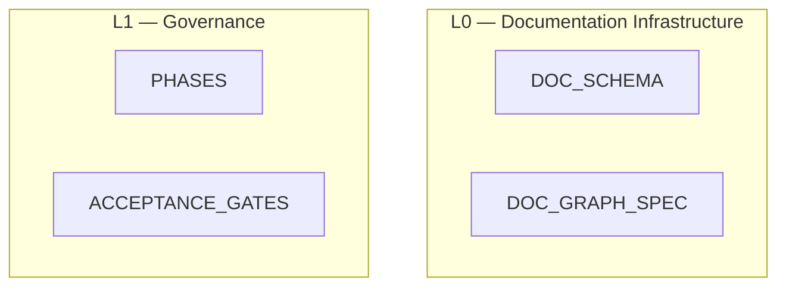

# Documentation Graph Visualization Specification (Normative)

## 1. Purpose

This spec defines the **canonical documentation graph model** used to render and validate the repository’s documentation system and a deterministic procedure to produce one or more concrete outputs (e.g., Mermaid, DOT).

It exists to ensure tooling can:

* classify documents into conceptual layers **L0–L5** deterministically,
* validate cross-document dependencies,
* enforce structural consistency of the documentation system,
* render a stable and reproducible visualization of documentation relationships.

This spec does **not** define document content. It defines how documents are **modeled, classified, and connected**.

---

## 2. Graph primitives

### 2.1 Node types

Tooling MUST represent the documentation system using the following node types.

#### A) `doc` node

Represents a single Markdown or JSON artifact that participates in the documentation system.

**Identity**

* Node key: `doc_id`

**Required attributes**

* `doc_id` (string; unique)
* `name` (filename; string)
* `kind` (enum; from `DOC_SCHEMA`)
* `authority` (`normative` | `non_normative`)
* `status` (`draft` | `active` | `deprecated`)
* `scope` (enum token from registry/schema)
* `layer` (enum; **computed**, not authored; see §3)

**Optional attributes**

* `description`
* `url` OR `urls`

There is no separate `layer` node type. Layer is a derived classification attribute.

---

#### B) `repository` node

A single root node used to anchor layout.

**Identity**

* Node key: fixed `REPOSITORY`

Exactly one `repository` node MUST exist in rendered output.

---

### 2.2 Edge types

Tooling MUST use only the following directed edge types.

#### A) `references`

Represents an explicit document dependency.

* `doc` → `doc`
* Derived from YAML `references: [...]`
* Type = `normative`

#### B) `mentions`

Represents a non-authoritative `@DOC_ID` mention in body text.

* `doc` → `doc`
* Derived from Markdown prose (see §5)
* Type = `prose`

These edges MUST NOT override YAML dependencies.

#### C) `produces` (optional)

Represents generated artifacts or reports.

* `doc` → `doc`

Use only when explicitly modeling generated outputs (e.g., graph reports).

---

### 2.3 Edge direction

Edges always point:

```
referrer → referred
```

If `A.references` includes `B`, render:

```
A → B
```

---

### 2.4 Edge de-duplication

If both:

* YAML `references`
* and `@DOC_ID` prose mention

produce the same edge:

* Emit a **single edge**
* Type = `references`

Prose edges are suppressed when redundant.

Multiple identical edges MUST NOT be emitted.

---

### 2.5 Canonical doc kinds

Graph tooling MUST interpret `kind` using the `DOC_SCHEMA` enum.

At minimum:

* `meta`
* `control`
* `architecture`
* `spec`
* `api`
* `oracle`
* `report`
* `map`
* `idea`

---

## 3. Canonical layer mapping (normative)

Layer assignment is derived solely from `kind` using a fixed mapping; paths and titles are non-authoritative.

| `kind`         | Layer | Notes                                                              |
| -------------- | ----- | ------------------------------------------------------------------ |
| `meta`         | L0    | Documentation infrastructure (schemas/graph spec/etc.)             |
| `map`          | L0    | Documentation inventory / authority maps                           |
| `control`      | L1    | Governance (phases, gates, process constraints)                    |
| `architecture` | L2    | System structure (architecture, decomposition, registry)           |
| `spec`         | L3    | Behavioral contracts (core/shell specs)                            |
| `api`          | L3    | Public adapter/API contracts; still behavioral, not infrastructure |
| `oracle`       | L4    | Proof obligations / test oracle definitions                        |
| `report`       | L5    | Execution state                                                    |
| `idea`         | OUT   | Not in L0–L5; explicitly non-normative by default                  |

`layer` is a **computed attribute**, not an independent node.

If a normative document cannot be mapped to L0–L5, this is a **Gate 0 failure**.

---

## 4. Structural validation rules

### 4.1 Every normative doc must be classified

For every `doc` where `authority == normative`:

* `layer` MUST be one of L0–L5.
* It MUST NOT be OUT.
* It MUST appear in the graph.

Failure is a hard error.

---

### 4.2 Layer precedence ordering

Layers have strict precedence:

```
L0 > L1 > L2 > L3 > L4 > L5
```

Interpretation:

Higher layers constrain lower layers.

---

### 4.3 Cross-layer reference validation (diagnostic only)

This section defines a **recommended validation policy** for normative `references` edges. It does **not** change the fixed layer constraint chain. It applies only to explicit YAML `references`.

Let:

* `layer(A)` be the layer of the referencing document
* `layer(B)` be the layer of the referenced document

#### Intended semantic dependency direction

The layered model distinguishes between:

* **Constraint flow (L0 → L5)** — fixed structural validity chain
* **Semantic dependency flow** — explicit YAML `references`

Semantic dependencies should generally follow this principle:

> A document may depend on documents that define its meaning or governance, but should not depend on documents that merely validate or record it.

#### Recommended allowed reference directions

Tooling SHOULD treat the following as normal:

* `L0` → any layer (integration/meta surface)
* `L1` → `L2`, `L3`, `L4`, `L0`
* `L2` → None (intra-layer only)
* `L3` → `L2`
* `L4` → `L3`, `L2`
* `L5` → any layer

Tooling SHOULD treat the following as suspicious (emit warning):

* `L2–L4` → `L0`
    * Development layers should remain meta-agnostic.
* `L2` → `L1`
    * Architecture should not depend on governance rules.
* `L3` → `L1`
    * Specifications should not depend on workflow control.
* `L4` → `L1`
    * Oracles validate specs; they are not governed semantically by phases.
* `L3` → `L4`
    * Specifications must not depend on their own proof artifacts.

#### No hard blocking

Violations of these patterns:

* MUST NOT block graph construction.
* MUST NOT be treated as schema failures.
* MUST be emitted in the validation report under:
  `Cross-layer reference warnings`

This keeps the system:

* structurally deterministic,
* semantically expressive,
* non-dogmatic.

#### Rationale

* The **constraint chain** expresses validity conditions.
* The **reference edges** express semantic dependence.
* These are distinct mechanisms and must not be conflated.

Layering is a **normative interpretation model**, not a rigid import system.

---

## 5. Reference extraction and validation

### 5.1 YAML extraction

For each Markdown file:

1. Detect YAML front matter.
2. Parse YAML.
3. Validate against `DOC_SCHEMA.json`.
4. Register node keyed by `doc_id`.

---

### 5.2 Authoritative references

Extract only from YAML:

```
references: [DOC_ID, ...]
```

For each:

Create:

```
doc_id → referenced_doc_id
type = references
```

If referenced `DOC_ID` does not exist → hard failure.

---

### 5.3 Prose references (`@DOC_ID`)

Tooling MAY extract `@DOC_ID` tokens for linting.

#### Exclusion rule

Ignore fenced code blocks.

#### Token rule

Match:

```
@[A-Z][0-9A-Z_]*
```

Extract the DOC_ID portion.

#### Emission rule

* Create `mentions` edges.
* Do NOT treat as authoritative.
* Do NOT override YAML references.

Unknown prose DOC_ID → warning.

---

### 5.4 Determinism requirements

* Node and edge lists MUST be sorted before output.
* File iteration order MUST NOT affect output.
* Graph generation MUST be deterministic.

---

## 6. Rendering directives (deterministic layout)

### 6.1 Vertical ordering

Renderers MUST group documents by computed `layer` in vertical order:

```
REPOSITORY
L0
L1
L2
L3
L4
L5
```

This grouping is layout-only; no explicit layer nodes are required.

---

### 6.2 Layer grouping

In Mermaid:

Use `subgraph` blocks for each layer.

Example:



---

### 6.3 Edge styling

* YAML `references` → solid arrow
* Prose references → dashed arrow

A legend MUST be included.

---

## 6. Rendering directives (deterministic layout)

### 6.1 Vertical ordering

Renderers MUST group documents by computed `layer` in vertical order:

```
REPOSITORY
L0
L1
L2
L3
L4
L5
```

This grouping is layout-only; no explicit layer nodes are required.

---

### 6.2 Layer grouping

In Mermaid:

Use `subgraph` blocks for each layer.

Example:


---

### 6.3 Edge styling

* YAML `references` → solid arrow
* Prose references → dashed arrow

A legend MUST be included.

---

## 7. Required outputs

### 7.1 Mermaid (required)

Must include:

* All `doc` nodes
* All normative edges
* Optional prose edges
* Layer grouping
* Legend

---

### 7.2 DOT (optional)

Edges:

* normative → solid
* prose → dashed

---

## 8. Visualization rules

### 8.1 Grouping (subgraphs / swimlanes)

Renderers SHOULD group nodes by `scope`:

* `global`, `core`, `shell`, `testing`,
* and component-specific tokens like `shell:runtime` if present.

If grouping is not supported by the output format, grouping may be omitted, but node labels MUST still include `scope` in an inspectable way (tooltip/label suffix).

### 8.2 Styling and legend (required)

Graph output MUST include a legend indicating:

* solid edges = YAML `references` (normative)
* dashed edges = prose `@DOC_ID` `mentions` (non-authoritative)

Optional node styling by `kind`:

* `control`: distinct shape/class
* `spec`, `oracle`, `api`, `map`, `report`, `idea`: distinct classes

(Exact colors/shapes are output-format-specific; the rule is that kinds must be distinguishable.)

### 8.3 Filtering modes (required)

Tooling MUST support generating filtered graphs:

1. **Normative-only**
    * Only YAML `references` edges.
2. **Full**
    * YAML `references` edges + `mentions` edges.

Optional filters:

* by `authority` (normative only),
* by `scope` (e.g., only `shell:*` docs),
* by gate/phase applicability ranges.

---

## 9. Validation and failure behavior

### 9.1 Hard failures (must BLOCK in strict mode)

Must BLOCK:

* Duplicate `doc_id`
* Missing YAML in required docs
* YAML schema invalid
* YAML `references` to unknown DOC_ID
* Normative doc not classifiable to L0–L5

### 9.2 Soft failures (warnings)

* Unknown prose `@DOC_ID`
* Cross-layer policy violation (unless strict mode)

### 9.3 Output report (required)

Tooling MUST emit a report summary including:

* total nodes
* total normative edges
* total prose edges
* list of unknown YAML references (if any)
* list of dangling prose mentions (if any)
* list of docs missing YAML (if any)

---

## 10. Validation Report Format (Normative)

Tooling MUST emit a structured validation report after graph extraction. The report MUST be deterministic and stable under file ordering. Output format MAY be JSON, Markdown, or both. JSON is recommended for CI; Markdown for human review.

---

### 10.1 Required top-level sections

The report MUST contain:

1. **Inventory Summary**
2. **Layer Assignment Summary**
3. **Normative Reference Matrix**
4. **Cross-Layer Diagnostics**
5. **Structural Failures**
6. **Prose Reference Diagnostics**
7. **Determinism Check**

---

### 10.2 Inventory Summary

Must include:

* total documents discovered
* total normative documents
* total non-normative documents
* total YAML `references` edges
* total prose `@DOC_ID` mentions
* total unique `doc_id` values

Example:

```json
{
  "total_docs": 42,
  "normative_docs": 37,
  "non_normative_docs": 5,
  "normative_edges": 81,
  "prose_edges": 23,
  "unique_doc_ids": 42
}
```

---

### 10.3 Layer Assignment Summary

Tooling MUST emit:

* Count of documents per layer (L0–L5, OUT)
* List of normative docs that failed layer mapping (if any)

Example:

```json
{
  "L0": 4,
  "L1": 2,
  "L2": 2,
  "L3": 14,
  "L4": 8,
  "L5": 3,
  "OUT": 9,
  "unclassified_normative_docs": []
}
```

If any normative doc cannot be mapped → **Hard failure**.

---

### 10.4 Normative Reference Matrix

Tooling MUST compute a layer-to-layer matrix for YAML `references`. Matrix entry `[A][B]` = number of edges from layer A → layer B.

Example:

| From \ To | L0 | L1 | L2 | L3 | L4 | L5 |
| --------- | -- | -- | -- | -- | -- | -- |
| L0        | 0  | 2  | 3  | 5  | 1  | 0  |
| L1        | 4  | 0  | 2  | 3  | 1  | 0  |
| L2        | 0  | 0  | 0  | 6  | 0  | 0  |
| L3        | 0  | 0  | 3  | 0  | 0  | 0  |
| L4        | 0  | 0  | 5  | 9  | 0  | 0  |
| L5        | 2  | 1  | 3  | 4  | 2  | 0  |

This table is critical because it reveals:

* illegal upward semantic coupling
* meta leakage into dev layers
* architectural drift over time

This matrix MUST be sorted and deterministic.

---

### 10.5 Cross-Layer Diagnostics

For each YAML `references` edge:

If it violates the recommended semantic policy (§6):

Emit:

```json
{
  "type": "cross_layer_warning",
  "from_doc": "ARCHITECTURE",
  "from_layer": "L2",
  "to_doc": "PHASES",
  "to_layer": "L1",
  "reason": "Architecture should not depend on governance"
}
```

This section MUST list:

* all suspicious edges
* total suspicious edge count

These are **warnings**, not hard failures.

---

### 10.6 Structural Failures (Hard Errors)

The following MUST block in strict mode:

* Duplicate `doc_id`
* Missing YAML in required doc
* YAML schema invalid
* YAML `references` to unknown `doc_id`
* Normative doc without layer assignment

Each error MUST include:

```json
{
  "type": "hard_failure",
  "doc_id": "X",
  "message": "Duplicate doc_id"
}
```

---

### 10.7 Prose Reference Diagnostics

Tooling MUST emit:

* total prose mentions
* list of unknown prose targets
* list of prose-only references (not in YAML)

Example:

```json
{
  "unknown_prose_targets": ["UNKNOWN_DOC"],
  "prose_only_edges": [
    {"from": "ARCHITECTURE", "to": "DECOMPOSITION"}
  ]
}
```

These MUST NOT block.

---

### 10.8 Determinism Check

Tooling MUST ensure:

* Node list sorted lexicographically by `doc_id`
* Edge list sorted `(from_doc, to_doc)`
* Report output stable across runs

Emit:

```json
{
  "deterministic_ordering": true
}
```

If false → treat as tool implementation error.

---

### Why this matters

This gives you:

* a structural audit surface (hard guarantees),
* a semantic drift surface (warnings),
* a measurable architectural health signal (matrix),
* CI-friendly diffability.
* It keeps layering philosophical and normative — while making enforcement mechanical and measurable.

---
