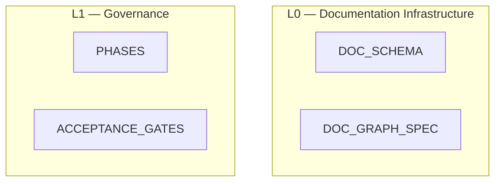

# Documentation Graph Visualization Specification (Normative)

## 1. Purpose

This spec defines the **canonical documentation graph model** used to render and validate the repository’s documentation system and a deterministic procedure to produce one or more concrete outputs (e.g., Mermaid, DOT).

It exists to ensure tooling can:

* classify documents into conceptual layers **L0–L5** deterministically,
* validate cross-document dependencies,
* enforce structural consistency of the documentation system,
* render a stable and reproducible visualization of documentation relationships.

This spec does **not** define document content. It defines how documents are **modeled, classified, and connected**.

---

## 2. Graph primitives

### 2.1 Node types

Tooling MUST represent the documentation system using the following node types.

#### A) `doc` node

Represents a single Markdown or JSON artifact that participates in the documentation system.

**Identity**

* Node key: `doc_id`

**Required attributes**

* `doc_id` (string; unique)
* `name` (filename; string)
* `kind` (enum; from `DOC_SCHEMA`)
* `authority` (`normative` | `non_normative`)
* `status` (`draft` | `active` | `deprecated`)
* `scope` (enum token from registry/schema)
* `layer` (enum; **computed**, not authored; see §3)

**Optional attributes**

* `description`
* `url` OR `urls`

There is no separate `layer` node type. Layer is a derived classification attribute.

---

#### B) `repository` node

A single root node used to anchor layout.

**Identity**

* Node key: fixed `REPOSITORY`

Exactly one `repository` node MUST exist in rendered output.

---

### 2.2 Edge types

Tooling MUST use only the following directed edge types.

#### A) `references`

Represents an explicit document dependency.

* `doc` → `doc`
* Derived from YAML `references: [...]`
* Type = `normative`

#### B) `mentions`

Represents a non-authoritative `@DOC_ID` mention in body text.

* `doc` → `doc`
* Derived from Markdown prose (see §5)
* Type = `prose`

These edges MUST NOT override YAML dependencies.

#### C) `produces` (optional)

Represents generated artifacts or reports.

* `doc` → `doc`

Use only when explicitly modeling generated outputs (e.g., graph reports).

---

### 2.3 Edge direction

Edges always point:

```
referrer → referred
```

If `A.references` includes `B`, render:

```
A → B
```

---

### 2.4 Edge de-duplication

If both:

* YAML `references`
* and `@DOC_ID` prose mention

produce the same edge:

* Emit a **single edge**
* Type = `references`

Prose edges are suppressed when redundant.

Multiple identical edges MUST NOT be emitted.

---

### 2.5 Canonical doc kinds

Graph tooling MUST interpret `kind` using the `DOC_SCHEMA` enum.

At minimum:

* `meta`
* `control`
* `architecture`
* `spec`
* `api`
* `oracle`
* `report`
* `map`
* `idea`

---

## 3. Canonical layer mapping (normative)

Layer assignment is derived solely from `kind` using a fixed mapping; paths and titles are non-authoritative.

| `kind`         | Layer | Notes                                                              |
| -------------- | ----- | ------------------------------------------------------------------ |
| `meta`         | L0    | Documentation infrastructure (schemas/graph spec/etc.)             |
| `map`          | L0    | Documentation inventory / authority maps                           |
| `control`      | L1    | Governance (phases, gates, process constraints)                    |
| `architecture` | L2    | System structure (architecture, decomposition, registry)           |
| `spec`         | L3    | Behavioral contracts (core/shell specs)                            |
| `api`          | L3    | Public adapter/API contracts; still behavioral, not infrastructure |
| `oracle`       | L4    | Proof obligations / test oracle definitions                        |
| `report`       | L5    | Execution state                                                    |
| `idea`         | OUT   | Not in L0–L5; explicitly non-normative by default                  |

`layer` is a **computed attribute**, not an independent node.

If a normative document cannot be mapped to L0–L5, this is a **Gate 0 failure**.

---

## 4. Structural validation rules

### 4.1 Every normative doc must be classified

For every `doc` where `authority == normative`:

* `layer` MUST be one of L0–L5.
* It MUST NOT be OUT.
* It MUST appear in the graph.

Failure is a hard error.

---

### 4.2 Layer precedence ordering

Layers have strict precedence:

```
L0 > L1 > L2 > L3 > L4 > L5
```

Interpretation:

Higher layers constrain lower layers.

---

### 4.3 Allowed cross-layer reference policy

For normative `references` edges:

Let `layer(A)` be source layer and `layer(B)` be target layer.

Rules:

| Source layer | Allowed target layers for **normative `references`** |
| ------------ | ---------------------------------------------------- |
| L0           | L0–L5                                                |
| L1           | L0, L2, L3, L4                                       |
| L2           | L2                                                   |
| L3           | L2, L3                                               |
| L4           | L2, L3, L4                                           |
| L5           | L0–L5                                                |


If violated:

* Tooling SHOULD emit a warning
* Strict mode MAY treat as error

This enforces the vertical constraint model without explicit layer nodes.

---

## 5. Reference extraction and validation

### 5.1 YAML extraction

For each Markdown file:

1. Detect YAML front matter.
2. Parse YAML.
3. Validate against `DOC_SCHEMA.json`.
4. Register node keyed by `doc_id`.

---

### 5.2 Authoritative references

Extract only from YAML:

```
references: [DOC_ID, ...]
```

For each:

Create:

```
doc_id → referenced_doc_id
type = references
```

If referenced `DOC_ID` does not exist → hard failure.

---

### 5.3 Prose references (`@DOC_ID`)

Tooling MAY extract `@DOC_ID` tokens for linting.

#### Exclusion rule

Ignore fenced code blocks.

#### Token rule

Match:

```
@[A-Z][0-9A-Z_]*
```

Extract the DOC_ID portion.

#### Emission rule

* Create `mentions` edges.
* Do NOT treat as authoritative.
* Do NOT override YAML references.

Unknown prose DOC_ID → warning.

---

### 5.4 Determinism requirements

* Node and edge lists MUST be sorted before output.
* File iteration order MUST NOT affect output.
* Graph generation MUST be deterministic.

---

## 6. Rendering directives (deterministic layout)

### 6.1 Vertical ordering

Renderers MUST group documents by computed `layer` in vertical order:

```
REPOSITORY
L0
L1
L2
L3
L4
L5
```

This grouping is layout-only; no explicit layer nodes are required.

---

### 6.2 Layer grouping

In Mermaid:

Use `subgraph` blocks for each layer.

Example:



---

### 6.3 Edge styling

* YAML `references` → solid arrow
* Prose references → dashed arrow

A legend MUST be included.

---

## 6. Rendering directives (deterministic layout)

### 6.1 Vertical ordering

Renderers MUST group documents by computed `layer` in vertical order:

```
REPOSITORY
L0
L1
L2
L3
L4
L5
```

This grouping is layout-only; no explicit layer nodes are required.

---

### 6.2 Layer grouping

In Mermaid:

Use `subgraph` blocks for each layer.

Example:


---

### 6.3 Edge styling

* YAML `references` → solid arrow
* Prose references → dashed arrow

A legend MUST be included.

---

## 7. Required outputs

### 7.1 Mermaid (required)

Must include:

* All `doc` nodes
* All normative edges
* Optional prose edges
* Layer grouping
* Legend

---

### 7.2 DOT (optional)

Edges:

* normative → solid
* prose → dashed

---

## 8. Visualization rules

### 8.1 Grouping (subgraphs / swimlanes)

Renderers SHOULD group nodes by `scope`:

* `global`, `core`, `shell`, `testing`,
* and component-specific tokens like `shell:runtime` if present.

If grouping is not supported by the output format, grouping may be omitted, but node labels MUST still include `scope` in an inspectable way (tooltip/label suffix).

### 8.2 Styling and legend (required)

Graph output MUST include a legend indicating:

* solid edges = YAML `references` (normative)
* dashed edges = prose `@DOC_ID` `mentions` (non-authoritative)

Optional node styling by `kind`:

* `control`: distinct shape/class
* `spec`, `oracle`, `api`, `map`, `report`, `idea`: distinct classes

(Exact colors/shapes are output-format-specific; the rule is that kinds must be distinguishable.)

### 8.3 Filtering modes (required)

Tooling MUST support generating filtered graphs:

1. **Normative-only**
    * Only YAML `references` edges.
2. **Full**
    * YAML `references` edges + `mentions` edges.

Optional filters:

* by `authority` (normative only),
* by `scope` (e.g., only `shell:*` docs),
* by gate/phase applicability ranges.

---

## 9. Validation and failure behavior

### 9.1 Hard failures (must BLOCK in strict mode)

Must BLOCK:

* Duplicate `doc_id`
* Missing YAML in required docs
* YAML schema invalid
* YAML `references` to unknown DOC_ID
* Normative doc not classifiable to L0–L5

### 9.2 Soft failures (warnings)

* Unknown prose `@DOC_ID`
* Cross-layer policy violation (unless strict mode)

### 9.3 Output report (required)

Tooling MUST emit a report summary including:

* total nodes
* total normative edges
* total prose edges
* list of unknown YAML references (if any)
* list of dangling prose mentions (if any)
* list of docs missing YAML (if any)

---
